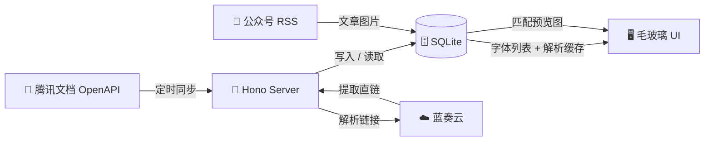

# 🐾 犬神志字库 · Fontezdown

<div align="center">

![banner]

**「汝、フォントを求めているか？」**

*— 你，在找字体对吧？*

一个为字体收藏家打造的私有资源下载站，运行在你的 VPS 上，永不下线。

[](#)
[](#)
[](#)
[](#)
[](#)

</div>

---

## ✨ 这是什么？

这是一个 **服务端渲染 + SQLite 缓存** 的字体目录站。你在腾讯文档里维护字体名称和蓝奏云分享链接，它自动同步 → 解析下载地址 → 在前端用毛玻璃美学界面展示。用户搜索 → 筛选 → 一键下载，一气呵成。

> 🎯 **核心哲学**：文档即数据库，蓝奏云即 CDN，VPS 即服务器。零外部依赖，自托管万岁。

---

## 🎨 界面预览

- 🫧 **液态玻璃风格** — SVG 滤镜实现实时毛玻璃效果，自适应网格布局
- 🔍 **分类筛选** — 按字体类别（丸系 / 圆系 / 超级系 / 黑系 / 楷系）和字重（三字重～多字重）筛选
- 🖼️ **预览图弹窗** — 公众号文章图片自动关联，支持缩放 / 拖拽 / 捏合手势
- 📡 **多 RSS 增量同步** — 历史源和持续更新源可同时配置，文章与图片记录只增量合并
- 🕒 **每日顺序同步** — 按服务器本地时间先同步腾讯文档，再逐个同步公众号 RSS
- 📦 **文件列表浮层** — 蓝奏云解析结果直接展示，点击即下载
- 📊 **实时统计面板** — 字体总数 / 当前显示 / 已解析 / 可下载文件数

---

## 🧬 架构一览



```
 src/
 ├── app.ts                    # 🚀 Hono 入口，路由挂载
 ├── config/config.ts          # ⚙️ 环境变量 & 运行时配置
 ├── routes/
 │   ├── api.ts                # 🔐 认证 / 同步 / 配置 / 解析
 │   └── lanzou.ts             # 🔗 蓝奏云兼容接口
 ├── ui/
 │   ├── indexPage.ts          # 🏠 首页 HTML（内联渲染）
 │   ├── adminPage.ts          # 🛠️ 后台管理 HTML
 │   └── brand.ts              # 🎀 品牌字体 & 站点名称
 ├── utils/
 │   ├── cacheDb.ts            # 💾 SQLite 初始化 & 迁移
 │   ├── fontCache.ts          # 📋 字体条目缓存
 │   ├── parsedCache.ts        # 📥 解析结果缓存
 │   ├── articleCache.ts       # 🖼️ 公众号文章缓存 & 智能匹配
 │   ├── settingsStore.ts      # 🔑 口令哈希 & Session 管理
 │   ├── tencentDocs.ts        # 📄 腾讯文档读取 & 链接提取
 │   ├── reply/reply.ts        # 📬 统一 JSON 响应格式
 │   └── lanzou/
 │       ├── lanzouParser.ts        # 🕷️ 蓝奏云页面抓取引擎
 │       ├── lanzouHttpClient.ts    # 🛡️ 请求自动重试 & 反爬
 │       └── anti_acw_sc__v2.ts     # 🔮 acw_sc__v2 算法破解
 └── generated/
     └── fontSeed.ts           # 🌱 400+ 预置字体回退数据
```

---

## 🚀 快速开始

### 前置条件

| 依赖 | 版本 |
|------|------|
| Node.js | `22.5+`（需要内置 `node:sqlite`，推荐 24+） |
| pnpm | `10.33.0+` |

### 本地运行

```bash
# 克隆仓库
git clone https://github.com/Alumos/fontezdown.git && cd fontezdown

# 安装依赖
pnpm install

# 复制环境变量模板
cp .env.example .env

# 启动开发服务器
pnpm run dev
```

打开 `http://localhost:1103`，然后：

1. 🔧 访问 `/admin` 设置后台口令
2. 📝 填入腾讯文档凭据 & 蓝奏云默认密码
3. 🔑 添加首页访问口令
4. 🏠 回到 `/` 输入口令 → 同步 → 浏览 → 下载！

---

## ⚙️ 配置

### 环境变量

```bash
# .env
PORT=1103
TENCENT_DOC_URL=https://docs.qq.com/doc/xxxx
TENCENT_DOC_CLIENT_ID=your_client_id
TENCENT_DOC_ACCESS_TOKEN=your_access_token
TENCENT_DOC_OPEN_ID=your_open_id
WECHAT_RSS_URLS=https://example.com/rss/history,https://example.com/rss/current
FONTEZDOWN_DATA_DIR=./data
```

> 💡 `WECHAT_RSS_URLS` 支持逗号、换行分隔或 JSON 字符串数组，旧的 `WECHAT_RSS_URL` 仍然兼容。环境变量仅作为初始默认值，在后台页面 `/admin` 保存后会持久化到 `data/settings.local`。

后台可以增删多个公众号 RSS 源，并设置每日自动同步时间（默认 `03:00`，按服务器本地时间）。从配置中删除 RSS 源不会删除 SQLite 中已经获取的文章和图片 URL 记录；后续同步也会增量合并，不会因源内容缩减而清理旧文章。

### 数据目录

```
data/
├── settings.local           # 🔐 口令哈希 + 腾讯凭据 + Session 密钥
├── fontezdown.sqlite        # 🗄️ 字体 / 解析 / 文章缓存
├── fonts.cache.json         # 📦 旧版缓存（首次启动自动迁移后废弃）
└── parsed.cache.json        # 📦 旧版缓存（同上）
```

> ⚠️ `data/` 目录已被 `.gitignore` 忽略，**切勿提交到公开仓库**。

---

## 🔐 双层认证

| 层级 | 路由保护 | 实现 |
|------|----------|------|
| **首页访问口令** | `/` | 多人多码，独立 label，随机生成 |
| **后台管理口令** | `/admin`、`/api/admin/*` | PBKDF2 100k 迭代 + HMAC 签名 cookie（12h TTL） |

口令哈希使用 `PBKDF2-SHA512` + 随机 salt，session cookie 使用 `HmacSHA256` 签名，防止篡改。

---

## 📡 API 速览

| 端点 | 方法 | 说明 |
|------|------|------|
| `/api/config` | `GET` | 公共配置状态 |
| `/api/fonts/sync` | `POST` | 从腾讯文档同步字体列表 |
| `/api/fonts/cache` | `GET` | 读取本地字体缓存 |
| `/api/articles/sync` | `POST` | 从主界面同步所有公众号 RSS |
| `/api/lanzou/parse` | `POST` | 解析蓝奏云链接为下载地址 |
| `/api/access/login` | `POST` | 首页口令登录 |
| `/api/admin/settings` | `GET/POST` | 后台配置读写 |
| `/api/admin/articles/sync` | `POST` | 同步公众号文章 |
| `/api/admin/config/export` | `GET` | 导出配置 JSON |
| `/api/admin/config/import` | `POST` | 导入配置 JSON |
| `/api/admin/access-passcodes` | `GET/POST/DELETE` | 管理首页访问口令 |
| `/lanzou` | `GET` | 旧版蓝奏云解析（兼容） |

---

## 🏗️ 生产构建 & 部署

```bash
pnpm run build   # tsc 编译到 dist/
pnpm start       # node dist/app.js
```

### systemd 服务

```ini
[Unit]
Description=犬神志字库
After=network.target

[Service]
Type=simple
WorkingDirectory=/opt/fontezdown
Environment=NODE_ENV=production
Environment=PORT=1103
ExecStart=/usr/bin/node dist/app.js
Restart=always
RestartSec=3

[Install]
WantedBy=multi-user.target
```

```bash
sudo systemctl enable --now fontezdown
```

然后前面套一层 **Nginx** 或 **Caddy** 反代到 `127.0.0.1:1103`，配上 HTTPS 就完事。

---

## 🛡️ 蓝奏云反爬虫

蓝奏云使用 `acw_sc__v2` 机制做反爬，本项目实现了完整的客户端计算算法：

- 🔮 **算法还原**：arg1 字符串重排 + 异或掩码 → 生成验证 cookie
- 🔁 **自动重试**：Axios 拦截器检测 521 状态码 → 自动计算 cookie → 重新请求
- 🌐 **多域名容错**：`lanzoux.com` / `lanzouf.com` / `lanzouj.com` 等 7 个域名自动轮换
- ⚡ **并发解析**：文件夹内文件 4 并发抓取

---

## 🖼️ 智能文章匹配

公众号 RSS 文章通过 **字符集相似度算法** 自动关联到对应字体条目：

```typescript
// articleScoreForFont() — 计算文章标题/内容与字体名的字符重合度
// 匹配成功 → 文章预览图自动显示在字体卡片上
```

用户点击预览图可进入 **全屏查看模式**，支持缩放、拖拽和双指捏合手势。

---

## 🔒 安全须知

- 🔐 `data/settings.local` 包含口令哈希、腾讯文档凭据、session 密钥
- 🗄️ `data/fontezdown.sqlite` 包含字体名、蓝奏云链接、下载地址
- 🚫 **绝不提交** `.env` / `.env.local` / `data/` 到公开仓库
- 🛡️ 公网部署务必设置**强口令**
- 📜 腾讯文档凭据应使用权限最小的 API 密钥

---

## 📜 免责声明

本项目仅供**个人字体资源整理**和**下载入口搭建**使用。请确保你拥有字体文件的使用和分发权限，并遵守腾讯文档、蓝奏云及相关字体授权协议。

---

<div align="center">

**🐾 犬神志字库 — 你的字体，你的规则。**

*Built with ❤️ and TypeScript, powered by 二次元の力*

</div>
